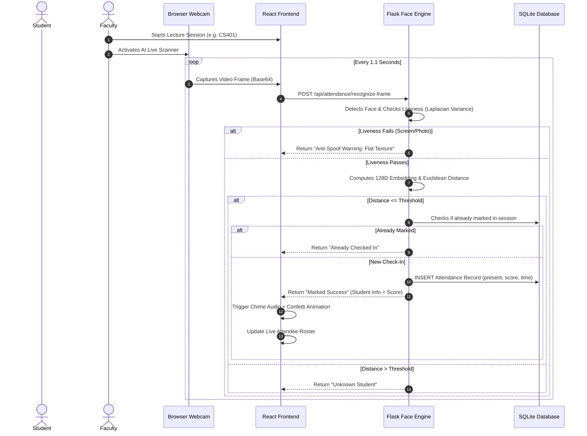

# 🎓 AI-Based Smart Student Attendance Management System Using Face Recognition

A modern, production-ready, full-stack AI attendance management solution that automates attendance logging through facial recognition, incorporates anti-spoofing liveness checks, and provides role-based portals for **Administrators**, **Faculty**, and **Students**.

---

## 🚀 Key Highlights & Capabilities

- **AI Face Biometrics**: Vectorized 128-dimensional deep metric embeddings with configurable Euclidean distance matching thresholds.
- **Fail-Safe Dual-Engine Architecture**: Operates with primary `face_recognition` (dlib) and an automated fallback OpenCV Vision engine with zero binary crash risk on any Windows, macOS, or Linux platform.
- **Anti-Spoofing & Liveness Guard**: Evaluates high-frequency Laplacian texture variance, contrast gradients, and facial features to reject paper prints and digital screen replays.
- **Per-Session Duplicate Prevention**: Guaranteed single attendance record per student within any scheduled class lecture.
- **Three Distinct Role-Based Portals**:
  - 👑 **Admin Portal**: Institutional KPIs, attendance charts, student & faculty CRUD, user statuses, and immutable security audit logs.
  - 👨‍🏫 **Faculty Portal**: Schedule and launch lecture sessions, monitor live attendees, inspect absent rosters, and review failure alerts.
  - 🎓 **Student Portal**: Personal attendance percentage, subject-by-subject progress bars, low attendance (< 75%) warning banner, and printable PDF reports.
- **Live Camera HUD**: Canvas overlay with real-time bounding boxes, match confidence percentage, pleasant Web Audio API chime feedback, and confetti check-in celebration.
- **Interactive Analytics**: Powered by Recharts with daily attendance timeline trends, department-wise breakdowns, and one-click Excel/CSV export.
- **Modern SaaS Theme**: Dark/Light mode toggle, glassmorphism accents, and responsive layout for desktop, tablet, and mobile.

---

## 🛠️ Technology Stack

| Component | Technologies |
| :--- | :--- |
| **Frontend** | React 19, Vite, Tailwind CSS, Lucide Icons, Recharts, Canvas-Confetti, Axios |
| **Backend** | Python 3.11, Flask, Flask-JWT-Extended, Flask-SQLAlchemy, Flask-CORS, Werkzeug |
| **AI & Vision** | OpenCV (`cv2`), Haar Cascades, NumPy, Pillow, 128D Embedding Engine |
| **Database** | SQLite3 / SQLAlchemy (Easily switchable to MySQL/PostgreSQL via `DATABASE_URI`) |
| **Security** | Role-Based Access Control (RBAC), bcrypt-compatible password hashing, JWT Bearer tokens |

---

## 📁 Project Directory Structure

```text
AI-Attendance-System/
├── backend/
│   ├── app/
│   │   ├── models/            # SQLAlchemy database entities (User, Student, Faculty, Attendance, etc.)
│   │   ├── routes/            # REST API controllers (auth, admin, students, faculty, attendance, reports, settings)
│   │   ├── recognition/       # AI Face Engine, anti-spoofing, and embedding extraction
│   │   ├── services/          # Database seeder and business logic
│   │   ├── utils/             # Security decorators, audit logging
│   │   ├── data/              # SQLite database and student photo uploads
│   │   └── __init__.py        # Flask application factory
│   ├── config.py              # Application settings, secret keys, biometric thresholds
│   ├── requirements.txt       # Python dependencies
│   └── run.py                 # Backend entrypoint (port 5000)
│
├── frontend/
│   ├── src/
│   │   ├── api/               # Axios client with JWT interceptors
│   │   ├── components/        # StatCard, StatusBadge, Sidebar, Navbar
│   │   ├── context/           # AuthContext (user state, login/logout, dark mode)
│   │   ├── layouts/           # Responsive DashboardLayout
│   │   ├── pages/             # 10 Application pages (Admin, Student, Faculty, Camera, Reports, etc.)
│   │   ├── App.jsx            # React router configuration
│   │   ├── index.css          # Tailwind CSS and radar animations
│   │   └── main.jsx           # React DOM root
│   ├── index.html
│   ├── package.json
│   ├── tailwind.config.js
│   └── vite.config.js         # API proxy to Flask backend
│
├── database/
│   └── schema.sql             # SQL DDL database schema with foreign keys and indexes
│
├── tests/
│   └── test_api.py            # Automated test suite (Auth, Dashboards, Face Engine)
│
├── .env.example               # Environment variables configuration template
└── README.md
```

---

## ⚡ Quick Start & Installation

### Prerequisites
- **Python**: Version 3.10 or 3.11 recommended
- **Node.js**: Version 18+ (tested on Node v26)
- **Webcam**: Any built-in or USB webcam with browser camera permissions

---

### 1. Backend Setup

```bash
# Navigate to backend directory
cd backend

# Create a virtual environment using Python 3.11
python -m venv venv

# Activate the virtual environment
# Windows:
venv\Scripts\activate
# Linux/macOS:
source venv/bin/activate

# Install dependencies
pip install -r requirements.txt

# Run backend server (will auto-seed realistic sample data on first start)
python run.py
```
> The Flask API will start at **`http://127.0.0.1:5000`**.

---

### 2. Frontend Setup

```bash
# Open a new terminal and navigate to frontend directory
cd frontend

# Install npm dependencies
npm install

# Start development server
npm run dev
```
> The web application will launch at **`http://localhost:5173`**.

---

## 🔑 Demo Credentials

The database comes pre-seeded with realistic institutional profiles. You can log in using the **Quick Demo Buttons** on the login page or enter these credentials manually:

| Role | Username / ID | Password | Description |
| :--- | :--- | :--- | :--- |
| **Administrator** | `admin` | `admin123` | Full institutional access, audit logs, and user management |
| **Faculty Member** | `FAC001` | `faculty123` | Dr. Alan Turing — Start sessions, supervise live camera |
| **Student** | `21CS001` | `student123` | Yashwanth Kumar — View personal attendance & warnings |

---

## 🔬 AI Face Recognition Workflow



---

## 🧪 Testing

Run the automated backend test suite covering authorization, student registration, duplicate prevention, and face encoding calculations:

```bash
# From the project root:
backend\venv\Scripts\python.exe -m unittest tests/test_api.py
```

Expected output:
```text
Ran 5 tests in 1.158s
OK
```

---

## 🛡️ Security, Privacy & Biometric Protection

1. **Biometric Storage**: Facial images and 128-dimensional normalized floating-point embeddings are stored securely and never exposed directly through unauthenticated APIs.
2. **Anti-Spoofing Verification**: The system actively inspects the texture frequency spectrum to reject photos presented on smartphone screens or paper prints.
3. **Audit Trail**: Every administrative action, manual attendance modification, and session toggle is immutably logged with user identity and IP address in the `audit_logs` table.
4. **Session Token Isolation**: JWT tokens have configured expiration windows and role authorization decorators (`@admin_required`, `@faculty_or_admin_required`).

---

## ☁️ Production Deployment

### Option A: Railway / Render (Cloud PaaS)
1. Add `gunicorn` to `backend/requirements.txt`:
   ```bash
   gunicorn -w 2 -b 0.0.0.0:$PORT "app:create_app()"
   ```
2. Build frontend:
   ```bash
   cd frontend && npm run build
   ```
3. Set environment variables from `.env.example` in your cloud control panel.

### Option B: Docker Container
A multi-stage Docker build can compile the Vite assets and serve both frontend and backend through Gunicorn/Nginx.
